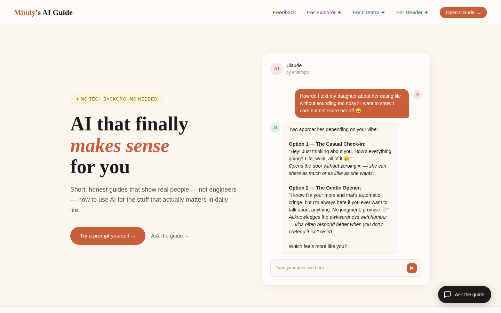
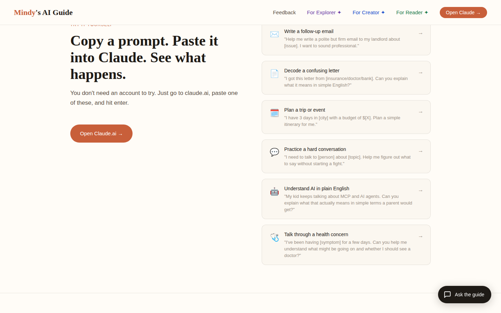

# Mindy's AI Guide

A website that teaches non-technical people how to use AI for everyday tasks — emails, documents, planning, hard conversations. No jargon, no tech background needed: short guides, copy-paste prompts you can try immediately, and a built-in "Ask the guide" chat powered by Claude.

**Live site:** [mindys-ai-guide.vercel.app](https://mindys-ai-guide.vercel.app)

## Screenshots





## What's on the site

- **Guides by audience** — separate tracks for explorers, creators, and readers
- **Prompt library** — real prompts for everyday situations, ready to paste into Claude
- **Ask the guide** — an embedded chat assistant that answers AI questions in plain English
- **[Explore Art with AI](https://mindys-ai-guide.vercel.app/explore-art.html)** — browsing MoMA's open-access collection with AI
- **[Quick Research prototype](https://mindys-ai-guide.vercel.app/research.html)** — a 7-screen user research flow on how people perceive AI, misinformation, and trust
- **SIGNAL** — an AI innovation feed

## Tech stack

- Plain HTML, CSS, and JavaScript — no framework, no build step
- Vercel serverless functions (`api/`) calling the [Claude API](https://docs.claude.com) for the chat features
- Python script (`scripts/`) for filtering MoMA's open dataset
- Deployed on Vercel

## Why I built it

I work in consulting, and my parents kept asking me whether AI was going to take their jobs. This site is my answer: AI isn't here to replace people — it's here to help them do their jobs better. Everything on the site is written for someone with zero technical background who wants to see that firsthand.

Built with [Claude Code](https://claude.com/claude-code).

## Running locally

No build tools needed — open `index.html` in a browser, or serve the folder:

```bash
python3 -m http.server 8080
```

The chat features need an `ANTHROPIC_API_KEY` environment variable and run as Vercel functions (`vercel dev`).
